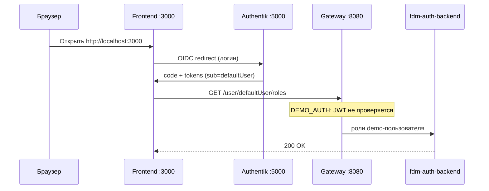

# BeeAtlas FDM Infrastructure (Docker Compose)

## Оглавление
1. [Общее описание](#1-общее-описание)
2. [Два режима запуска](#2-два-режима-запуска)
3. [Архитектура и сервисы](#3-архитектура-и-сервисы)
4. [Требования](#4-требования)
5. [Быстрый старт](#5-быстрый-старт)
6. [Submodules и локальная разработка](#6-submodules-и-локальная-разработка)
7. [Authentik — вход в приложение](#7-authentik--вход-в-приложение)
8. [Конфигурация](#8-конфигурация)
9. [Управление средой](#9-управление-средой)
10. [Порты и URL](#10-порты-и-url)
11. [Postman](#11-postman)
12. [Известные ограничения локального стенда](#12-известные-ограничения-локального-стенда)
13. [Лицензия](#13-лицензия)

---

## 1. Общее описание

`beeatlas-fdm-infrastructure` — репозиторий для поднятия **BeeAtlas FDM** одной командой Docker Compose.

Все сервисы находятся в сети `fdm-network` и используют общую инфраструктуру:

| Компонент | Назначение |
|-----------|------------|
| **PostgreSQL** (`postgres`) | Единая БД `fdm_db`, отдельные **схемы** на сервис (`init-schemas.sql`) |
| **RabbitMQ** (`rabbitmq`) | Очереди и exchange; конфиг в `rabbitmq/definitions.json` |
| **Redis** (`redis`) | Кэш для `architect-graph-service`; брокер для Authentik |
| **Neo4j** (`neo4j`) | Граф архитектуры для `architect-graph-service` |
| **MinIO** (`document-service-minio`) | S3-хранилище для `document-service` |
| **Authentik** (`authentik-server`, `authentik-worker`) | OIDC-логин для frontend |
| **Gateway** (`gateway`) | Единая точка входа API |
| **Frontend** (`beeatlas-frontend`) | UI BeeAtlas |

Общие переменные окружения — в **`common.env`**.

---

## 2. Два режима запуска

| Файл | Когда использовать |
|------|-------------------|
| **`docker-compose-run.yml`** | **Рекомендуется** — запуск **готовых образов** из GHCR (`ghcr.io/tech-beeline/...:latest`) |
| **`docker-compose.yml`** | Локальная **сборка** из submodules (`services/*/Dockerfile`) |

> **Рекомендация:** для первого запуска и повседневной работы со стендом предпочтительнее **`docker-compose-run.yml`**. Не нужна долгая Maven-сборка Java-сервисов, меньше проблем с сетью и зависимостями при `docker compose build`. Файл `docker-compose.yml` используйте, когда меняете код в submodule и нужно проверить свежие изменения до push образа в GHCR.

```bash
# Рекомендуемый способ — готовые образы
docker compose -f docker-compose-run.yml pull
docker compose -f docker-compose-run.yml up -d

# Локальная сборка (разработка)
docker compose up -d --build
```

Обновление всех образов из registry:

```bash
docker compose -f docker-compose-run.yml pull
docker compose -f docker-compose-run.yml up -d --force-recreate
```

> **Podman:** те же команды с `podman compose` вместо `docker compose`.

> **Важно:** изменения в submodule (например, миграции Flyway) попадут в `docker-compose-run.yml` только после **сборки и push образа** в GHCR. Для проверки свежего кода используйте `docker-compose.yml` или локальный `docker build`.

---

## 3. Архитектура и сервисы

### Инфраструктура

- `postgres`, `rabbitmq`, `redis`, `neo4j`
- `authentik-postgres`, `authentik-server`, `authentik-worker`
- `document-service-minio`, `document-service-minio-init`
- `on-premises` — Structurizr On-Premises (порт 8087)
- `mcp-gateway`, `mcp-gateway-init` — MCP gateway (Unla)
- `fdm-bpm-local-init` — одноразовая инициализация BPM URL в Postgres после старта `fdm-bpm`

### Java / Spring Boot

| Сервис | Схема Postgres | Назначение |
|--------|----------------|------------|
| `gateway` | — | API Gateway, маршрутизация, demo-auth |
| `fdm-auth-backend` | `user_auth` | Аутентификация и роли |
| `capability-backend` | `capability` | Business / Tech Capability |
| `products-service` | `product` | Продукты, контейнеры, операции |
| `techradar-backend` | `techradar` | Техрадар, технологии, процессы |
| `architect-graph-service` | — (Neo4j) | Архитектурный граф, RabbitMQ, Redis |
| `cx-service` | `cx` | Customer Journey |
| `notifications-service` | `notification` | Уведомления |
| `document-service` | `documents` | Документы (S3/MinIO) |
| `fdm-pack-loader` | `pack_loader` | Загрузка пакетов |
| `events-history` | `entity_events` | История событий сущностей |
| `fdm-bpm` | `processes` (+ Camunda) | BPM / процессы |

### Python / Node / прочее

| Сервис | Назначение |
|--------|------------|
| `structurizr-backend` | API диаграмм (FastAPI) |
| `ff-manager` | Feature flags (схема `ff`) |
| `obs-dashboard` | Генерация Grafana E2E-дашбордов по CJ |
| `beeatlas-frontend` | Frontend |
| `beeatlas-doc` | Документация (статический сервер) |

Схемы создаются при **первом** старте Postgres из `init-schemas.sql`:

`product`, `capability`, `user_auth`, `techradar`, `pack_loader`, `entity_events`, `processes`, `cx`, `notification`, `documents`, `ff`.

RabbitMQ при первом старте загружает очереди из `rabbitmq/definitions.json` (в т.ч. graph-очереди, `user_drop_cache`, `capability.exchange`).

---

## 4. Требования

| Компонент | Версия |
|-----------|--------|
| Docker Engine / Podman | 20.10+ / 4.0+ |
| Docker Compose (v2) | 2.0+ |
| Git | для submodules |
| Java 17 / Maven | только при сборке без Docker |

Убедитесь, что свободны порты **3000**, **5000**, **5433**, **5434**, **5672**, **7474**, **7687**, **8080–8097**, **15672** (при необходимости — переопределите через `*_SERVICE_PORT` в compose).

---

## 5. Быстрый старт

### 5.1 Клонирование с submodules

```bash
git clone --recurse-submodules https://github.com/tech-beeline/beeatlas-fdm-infrastructure.git
cd beeatlas-fdm-infrastructure
```

Если submodules не подтянулись:

```bash
git submodule update --init --recursive
```

### 5.2 Запуск стенда

Authentik и остальная инфраструктура поднимаются **всегда** — отдельный профиль Compose или флаги при старте не нужны.

**Готовые образы (рекомендуется):**

```bash
docker compose -f docker-compose-run.yml pull
docker compose -f docker-compose-run.yml up -d
```

**Локальная сборка**:

```bash
docker compose up -d --build
```

После старта дождитесь `healthy` у `postgres`, `fdm-auth-backend`, `gateway`, `authentik-server`, затем переходите к [разделу 7](#7-authentik--вход-в-приложение) — там пошаговый вход в UI.

В БД появляются тестовые данные auth/products (миграции в submodules).

### 5.3 Проверка

```bash
docker compose ps
curl -s http://localhost:8080/actuator/health
curl -s http://localhost:8081/actuator/health   # fdm-auth-backend
curl -s http://localhost:5000/application/o/beeatlas/.well-known/openid-configuration
```

Подробная проверка Authentik и вход в UI — в [разделе 7](#7-authentik--вход-в-приложение).

---

## 6. Submodules и локальная разработка

Исходники микросервисов — git submodules в `services/` (см. `.gitmodules`).

Typical workflow:

```bash
# обновить submodule до последнего main
cd services/techradar-service && git pull origin main && cd ../..

# пересобрать один сервис
docker compose build techradar-backend
docker compose up -d techradar-backend
```

Для `docker-compose-run.yml` после push в GitHub дождитесь нового образа в GHCR и выполните `pull` (см. раздел 2).

Frontend и `beeatlas-doc` — отдельные репозитории (`../beeatlas-prospect-frontend`, `../beeatlas-doc`), подключаются в `docker-compose.yml` через `build.context`.

---

## 7. Authentik — вход в приложение

Authentik на локальном стенде нужен **только для UI**: форма логина, logout и обновление сессии на frontend.  
API через gateway при этом работает в demo-режиме (`DEMO_AUTH=true`) — JWT на backend **не проверяется**.

Отдельный профиль Compose или переменные при `docker compose up` **не нужны** — Authentik поднимается вместе со всем стеком.

### Как это устроено



| Компонент | Роль |
|-----------|------|
| **Authentik** | IdP для frontend: логин / logout |
| **Frontend** | OIDC-клиент, slug приложения **`beeatlas`** |
| **Gateway** | Проксирует API как `defaultUser` без проверки токена |
| **fdm-auth-backend** | Хранит профиль и роли `defaultUser` в БД |

Всё перечисленное ниже настраивается **автоматически** blueprint'ом `authentik-blueprints/fdm-minimal.yaml` (монтируется в `authentik-server` и `authentik-worker`).

### Режимы gateway

Значения для `gateway` — в **`docker-compose.yml`** / **`docker-compose-run.yml`** (секция `gateway` → `environment`). Подробная таблица — [раздел 8](#8-конфигурация). После смены режима: `docker compose up -d gateway`.

### Пошаговая инструкция: первый запуск

**Шаг 1.** Поднимите стенд (см. [раздел 5](#52-запуск-стенда)):

```bash
# рекомендуется
docker compose -f docker-compose-run.yml pull
docker compose -f docker-compose-run.yml up -d
# или локальная сборка
docker compose up -d --build
```

**Шаг 2.** Дождитесь готовности сервисов:

```bash
docker compose ps
```

Должны быть `running` / `healthy`: `authentik-server`, `authentik-worker`, `authentik-postgres`, `redis`, `gateway`, `fdm-auth-backend`, `beeatlas-frontend`.

**Шаг 3.** Убедитесь, что blueprint применился (подождите 30–60 с после старта worker):

```bash
curl -s -o /dev/null -w "%{http_code}" http://localhost:5000/application/o/beeatlas/.well-known/openid-configuration
```

```powershell
# Windows (PowerShell)
(Invoke-WebRequest -Uri "http://localhost:5000/application/o/beeatlas/.well-known/openid-configuration" -UseBasicParsing).StatusCode
```

Ожидается **`200`**. Если **`404`** — blueprint ещё не применился или упал с ошибкой, см. [устранение неполадок](#устранение-неполадок).

**Шаг 4.** Откройте frontend: **http://localhost:3000**

**Шаг 5.** На редиректе в Authentik войдите:

| Поле | Значение |
|------|----------|
| Логин | `akadmin` |
| Пароль | `password` (из `AUTHENTIK_BOOTSTRAP_PASSWORD` в `docker-compose.yml`) |

**Шаг 6.** После успешного входа вы попадёте обратно на frontend. Приложение загрузит роли пользователя `defaultUser`.

### Пошаговая инструкция: выход

1. В UI нажмите **Выход**.
2. Frontend отправит запрос на `http://localhost:5000/application/o/beeatlas/end-session/`.
3. Authentik завершит сессию и перенаправит на `http://localhost:5000`.

Если при выходе **404** — проверьте, что в Authentik есть приложение со slug **`beeatlas`** (не `fdm-app`). См. [устранение неполадок](#устранение-неполадок).

### Что создаёт blueprint (справочно)

Ручная настройка в UI Authentik **не требуется**, если blueprint в статусе `successful`. Для справки:

| Параметр | Значение |
|----------|----------|
| Файл | `authentik-blueprints/fdm-minimal.yaml` |
| OAuth2-приложение | slug **`beeatlas`**, имя `beeatlas` |
| `client_id` | `SxbmzvcDJHqs415xgqo8hPQh6CtHvop5jFGF1Wb2` |
| Redirect URI | regex `http://localhost:3000/.*` |
| Пользователь | `akadmin` → в токене `sub=defaultUser` |
| Профиль в токене | Ivan Ivanov, `default@beeline.ru` |
| Logout | invalidation flow → редирект на `http://localhost:5000` |

Проверка в админке Authentik (**http://localhost:5000**):

1. **Applications** → есть `beeatlas`
2. **System → Blueprints** → `FDM minimal setup` → статус **`successful`**

### Изменение blueprint

После правок `authentik-blueprints/fdm-minimal.yaml`:

```bash
# Docker
docker restart authentik-worker

# Podman
podman restart authentik-worker
```

Подождите ~20 с и проверьте статус blueprint в UI или командой `curl` из шага 3.

> **Важно:** перезапуск `authentik-server` **не переприменяет** blueprint — нужен именно **`authentik-worker`**.

### Устранение неполадок

| Симптом | Причина | Решение |
|---------|---------|---------|
| **Redirect URI Error** при логине | redirect URI не совпадает | В blueprint должен быть regex `http://localhost:3000/.*`; перезапустите `authentik-worker` |
| **404** на `/application/o/beeatlas/...` | приложение не создано или slug другой | Проверьте blueprint (статус `successful`); в Applications должен быть slug `beeatlas` |
| **404** на `/user/.../roles` после логина | в токене `sub` не `defaultUser` | Перелогиньтесь; в blueprint scope mapping задаёт `sub` из `winaccountname` |
| Blueprint в статусе **error** | синтаксическая ошибка YAML | `docker logs authentik-worker 2>&1 \| grep fdm-minimal`; исправьте файл, перезапустите worker |
| Старая сессия / странное поведение | кэш OIDC в браузере | Очистите localStorage/sessionStorage для `localhost:3000`, перелогиньтесь |
| Изменения blueprint не видны | worker не перечитал файл | `podman restart authentik-worker`, подождать 20–30 с |

Логи worker:

```bash
docker logs authentik-worker 2>&1 | grep -E "fdm-minimal|blueprint|failed"
```

### Учётные данные и URL

| Что | URL / значение |
|-----|----------------|
| Frontend | http://localhost:3000 |
| Authentik (UI + OIDC) | http://localhost:5000 |
| Админ Authentik | `akadmin` / `password` |
| Demo-пользователь в API | `defaultUser` (логин в fdm-auth БД) |
| OIDC discovery | http://localhost:5000/application/o/beeatlas/.well-known/openid-configuration |

---

## 8. Конфигурация

### Режимы аутентификации gateway

Переменные задаются в **`docker-compose.yml`** и **`docker-compose-run.yml`** (секция `gateway` → `environment`).  
URL Authentik внутри сети compose — в **`common.env`** (`INTEGRATION_AUTHENTIC_AUTH_URL`).

#### Режим 1: Demo (по умолчанию, локальный стенд)

UI логинится через Authentik, API на gateway **без проверки JWT** — запросы идут как demo-пользователь `defaultUser`.

| Переменная | Значение |
|------------|----------|
| `DEMO_AUTH` | `'true'` |
| `AUTHENTIC_AUTH` | `'false'` |
| `SPRING_PROFILES_ACTIVE` | `local` |
| `JWKS` | `jwks` |

```yaml
# gateway → environment
DEMO_AUTH: 'true'
AUTHENTIC_AUTH: 'false'
SPRING_PROFILES_ACTIVE: local
JWKS: "jwks"
```

#### Режим 2: Authentik (проверка JWT)

API принимает только запросы с `Authorization: Bearer <token>`. Подпись JWT проверяется по JWKS Authentik (`INTEGRATION_AUTHENTIC_AUTH_URL` в `common.env`).

| Переменная | Значение |
|------------|----------|
| `DEMO_AUTH` | `'false'` |
| `AUTHENTIC_AUTH` | `'true'` |
| `SPRING_PROFILES_ACTIVE` | `default` |
| `JWKS` | `jwks` (не используется при `AUTHENTIC_AUTH=true`) |

```yaml
# gateway → environment
DEMO_AUTH: 'false'
AUTHENTIC_AUTH: 'true'
SPRING_PROFILES_ACTIVE: default
JWKS: "jwks"
```

После смены режима:

```bash
docker compose up -d gateway
```

Frontend менять не нужно: при `FLAG_IS_DEMO_STAND=true` он уже отправляет Bearer-токен Authentik.

### `common.env`

Общие настройки для большинства Java-сервисов:

- Postgres: `SPRING_DATASOURCE_*`
- RabbitMQ: `SPRING_RABBITMQ_HOST=rabbitmq` (имя **сервиса**, не `container_name`)
- Neo4j, Redis, URL интеграций между сервисами
- Authentik (внутри сети compose): `INTEGRATION_AUTHENTIC_AUTH_URL=http://authentik-server:9000`

Переопределения для отдельных сервисов — в секции `environment` в compose.

### Ключевые переменные по сервисам

| Сервис | Переменные |
|--------|------------|
| **gateway** | `DEMO_AUTH`, `AUTHENTIC_AUTH`, `QUEUE_USER_DROP_CACHE_NAME` |
| **beeatlas-frontend** | `FLAG_IS_DEMO_STAND`, `FLAG_AUTHENTIK_URL`, `FLAG_AUTHENTIK_CLIENT_ID`, `NGINX_LOCATION_API_GATEWAY` |
| **architect-graph-service** | `SPRING_REDIS_*`, `INTEGRATION_PRODUCT_SERVER_URL`, RabbitMQ exchange |
| **fdm-bpm** | отдельные datasource для Camunda / processes / git |
| **ff-manager** | `FF_DB_*`, `FF_*_API_BASE_URL` |
| **obs-dashboard** | `GRAFANA_URL`, `E2E_TEMPLATE_URL`, `CX_SERVICE_URL`, `PRODUCT_SERVICE_URL` |

### Где задавать переменные

- **`docker-compose.yml`** / **`docker-compose-run.yml`** — режим gateway, порты, переменные frontend
- **`common.env`** — общие URL, БД, RabbitMQ, `INTEGRATION_AUTHENTIC_AUTH_URL` и др. для Java-сервисов

---

## 9. Управление средой

```bash
# остановка (данные сохраняются)
docker compose down
docker compose -f docker-compose-run.yml down

# полная очистка томов (чистая БД, RabbitMQ, Neo4j…)
docker compose down -v

# логи
docker compose logs -f gateway
docker compose logs -f authentik-worker
docker compose logs -f techradar-backend

# перезапуск одного сервиса
docker compose restart capability-backend
```

> `down` **не удаляет** тома. `down -v` — удаляет `postgres-data`, `rabbitmq-data` и др.; `init-schemas.sql` выполнится только при **первом** создании volume Postgres.

После `down -v` Flyway накатывает миграции заново. Для techradar на чистой БД миграция V19 вставляет процессы только для `tech_id`, которые уже есть в таблице `tech`.

---

## 10. Порты и URL

| Компонент | Host URL | Примечание |
|-----------|----------|------------|
| **Frontend** | http://localhost:3000 | beeatlas-frontend |
| **Gateway** | http://localhost:8080 | API / Swagger |
| **Authentik UI** | http://localhost:5000 | OIDC, админка |
| **beeatlas-doc** | http://localhost:8097 | документация |
| **fdm-auth-backend** | http://localhost:8081 | |
| **capability-backend** | http://localhost:8082 | |
| **architect-graph-service** | http://localhost:8083 | |
| **products-service** | http://localhost:8084 | |
| **techradar-backend** | http://localhost:8085 | |
| **structurizr-backend** | http://localhost:8086/docs | OpenAPI |
| **Structurizr On-Premises** | http://localhost:8087 | |
| **cx-service** | http://localhost:8088 | |
| **notifications-service** | http://localhost:8089 | |
| **document-service** | http://localhost:8091 | |
| **fdm-pack-loader** | http://localhost:8092 | |
| **events-history** | http://localhost:8093 | |
| **fdm-bpm** | http://localhost:8094 | |
| **ff-manager** | http://localhost:8095 | |
| **obs-dashboard** | http://localhost:8096 | Node.js API |
| **PostgreSQL** | localhost:5433 | `postgres/postgres`, БД `fdm_db` |
| **Authentik Postgres** | localhost:5434 | `authentik/authentik`, БД `authentik_db` |
| **RabbitMQ UI** | http://localhost:15672 | `guest/guest` |
| **Neo4j Browser** | http://localhost:7474 | `neo4j/password` |
| **Neo4j Bolt** | bolt://localhost:7687 | |
| **MinIO API / Console** | :9000 / :9001 | если порты не переопределены |
| **MCP Gateway** | http://localhost:18080 | Unla |

Порты настраиваются через переменные `*_SERVICE_PORT` в compose.

---

## 11. Postman

В папке `postman/` — коллекция для Gateway.

- Import → файл из `postman/`
- Переменная окружения `baseUrl` = `http://localhost:8080`

---

## 12. Известные ограничения локального стенда

| Тема | Детали |
|------|--------|
| **Grafana** | В compose **нет** сервиса Grafana; URL в `common.env` — заглушка. `obs-dashboard` требует реальный Grafana и корректный `E2E_TEMPLATE_URL` для полной работы |
| **obs-dashboard** | При старте проверяет формат `E2E_TEMPLATE_URL` (`{GRAFANA_URL}/d/{uid}/...`). Без Grafana API publish дашбордов не заработает |
| **GHCR образы** | Тег `:latest` кэшируется локально — используйте `pull` перед `up` или `pull_policy: always` на отдельных сервисах в `docker-compose-run.yml` |
| **Authentik blueprint** | Подробности — [раздел 7](#7-authentik--вход-в-приложение); кратко: при ошибке YAML перезапустите `authentik-worker` |
| **init-schemas.sql** | Только при **первом** создании volume Postgres; на существующей БД схемы добавляйте вручную |
| **RabbitMQ definitions** | На существующем volume RabbitMQ новые exchange/очереди из JSON могут не подтянуться — пересоздайте volume или добавьте вручную |
| **Внешние интеграции** | CMDB, staging-sequence, ambassador и др. в `common.env` — mock URL, сервисов в compose нет |

---

## 13. Лицензия

Проект распространяется под **Apache License 2.0**. См. файл `LICENSE`.

---

## Краткий чек-лист

| Шаг | Команда |
|-----|---------|
| Клон с submodules | `git clone --recurse-submodules …` |
| Стенд (build) | `docker compose up -d --build` |
| Стенд (GHCR) | `docker compose -f docker-compose-run.yml pull && docker compose -f docker-compose-run.yml up -d` |
| Режим gateway | см. [раздел 8](#8-конфигурация): demo или Authentik, затем `docker compose up -d gateway` |
| Обновить образы | `docker compose -f docker-compose-run.yml pull && docker compose -f docker-compose-run.yml up -d --force-recreate` |
| UI + вход | [раздел 7](#7-authentik--вход-в-приложение): http://localhost:3000 → **akadmin** / **password** |
| Остановка | `docker compose down` |
| Чистая БД | `docker compose down -v` |
| Логи | `docker compose logs -f <service-name>` |
